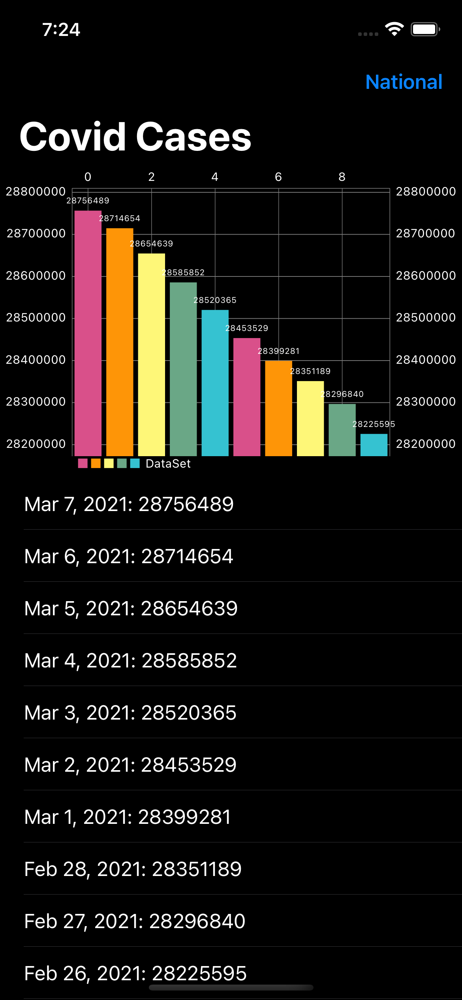
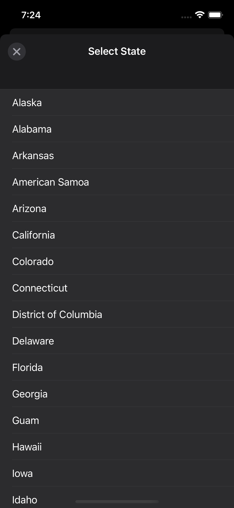
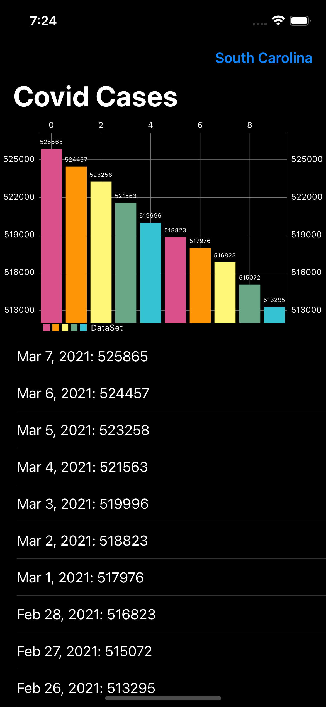

# COVID-Tracker

This application graphs the spread of the COVID virus by date. You can also remove a specific state to track statistics.

## Tech Stack

**Stack:** Swift, UIKit, URLSession, GCD, MVC, CocoaPods


## API Reference


```http
https://api.covidtracking.com/v2/us/daily.json

https://api.covidtracking.com/v2/states/daily.json
```

  

